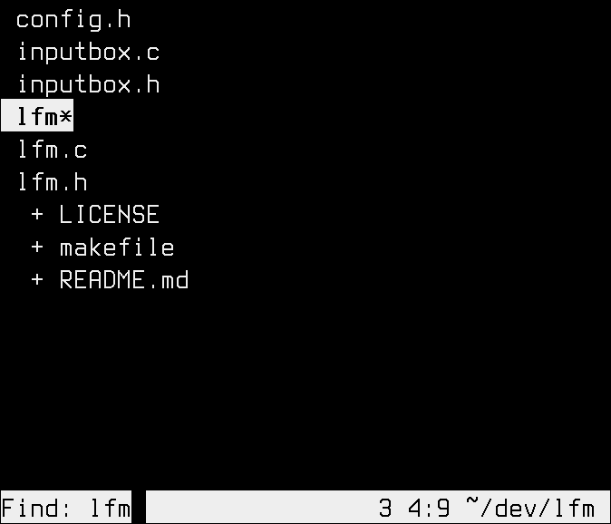

<h1 align="center">lfm</h1>

Tiny ncurses file manager.

It is basically a tui frontend for your basic commands, such as `cp`, `mv`, `rm`, etc.

## Features

lfm has a very minimal set of features:

* Configurable colors and keybinds;
* Simple search functionality;
* Selection of multiple files;
* Delete/copy/move selected files;

## Installation
Compile with:

    make install

Disable colors, if you're colorphobic:

    make install USECOLOR=

## Configuration
* Simply edit `config.h` and recompile.

